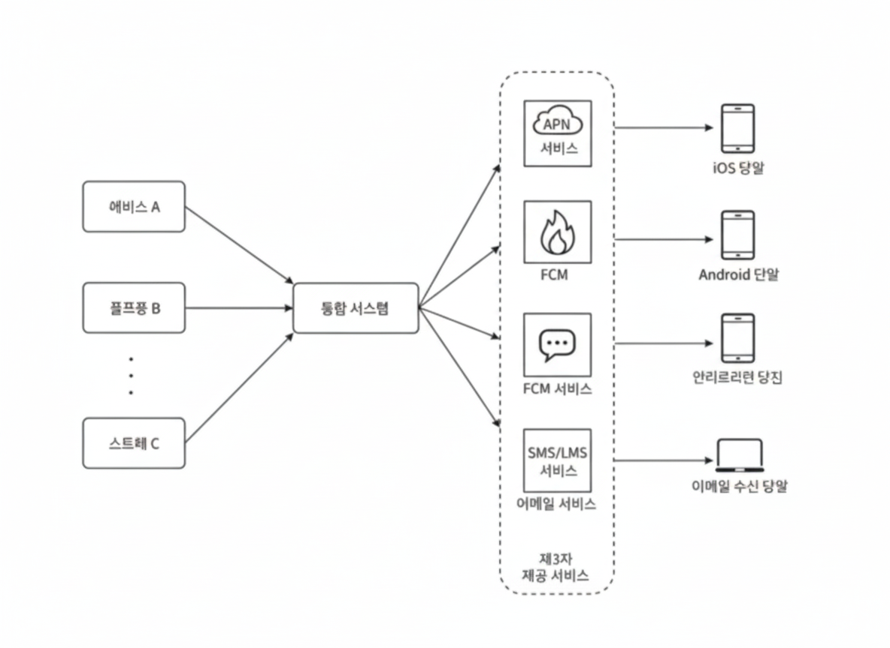
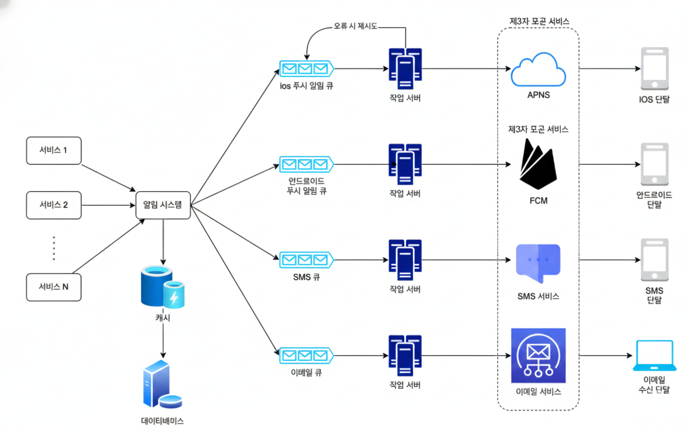

# 알림 시스템
알림 시스템은 세 가지로 분류할 수 있다.
- 모바일 푸시 알림
- SMS 메시지
- 이메일

# 1단계 문제 이해 및 설계 범위 확정
> 하루에 백만 건 이상의 알림을 처리하는 확장성 높은 시스템을 구축하는 것은 쉽지 않기 때문에 면접에 출제될 때는 정해진 정답이 없고 문제 자체가 모호하게 주어진다. 따라서 적절한 질문을 통해 요구사항이 무엇인지 지원자 스스로 알아내야 한다.

# 2단계 개략적 설계안 제시 및 동의 구하기
## 알림 유형별 지원 방안
### iOS 푸시 알림
```
알림 제공자 -> APNS -> iOS 단말
```
- 알림 제공자: 알림을 만들어내는 주체
	- 알림 요청을 만들기 위한 데이터:
		- 단말 토큰: 알림 제공자를 APNS에서 식별하기 위한 고유 식별자
		- 페이로드: 알림 내용을 담은 JSON 딕셔너리
- APNS: 애플이 제공하는 원격 서비스. 푸시 알림을 iOS 장치로 보내는 역할을 담당한다.
### 안드로이드 푸시 알림
```
알림 제공자 -> FCM -> 안드로이드 단말
```
- FCM: 안드로이드의 APNS. 푸시 알림을 안드로이드 장치로 보내는 역할을 담당한다.
### SMS 메시지
```
알림 제공자 -> SMS 서비스 -> SMS 수신 단말
```
- SMS 서비스: SMS는 보통 제3 샂업자의 서비스를 많이 이용한다. 한국 같은 경우에는 coolsms가 있다.
### 이메일
```
알림 제공자 -> 이메일 서비스 -> 이메일 수신 단말
```
- 이메일 서비스: 대부분의 회사는 고유 이메일 서버를 구축할 역량을 갖고는 있지만 많은 회사가 사용 이메일 서비스(ex. 메일침프, 구글 워크스페이스)를 이용한다. 

| **구분**    | **자체 구축 서버**    | **상용 이메일 서비스**  |
| --------- | --------------- | --------------- |
| **초기 비용** | 서버 구축비 발생       | 낮음 (구독제)        |
| **관리 주체** | 사내 IT 팀 (부담 높음) | 서비스 제공사 (부담 없음) |
| **도달률**   | 보장하기 어려움        | 매우 높음           |
| **추가 기능** | 직접 개발 필요        | 분석, 템플릿, 자동화 포함 |
> 직접 서버를 운영하면 메일이 상대방의 '스팸함'으로 빠질 확률이 매우 높다.

## 연락처 정보 수집 절차
알림을 보내기 위한 정보(ex. 모바일 단말 토큰, 전화번호, 이메일 등)는 사용자가 우리 앱을 처음 설치하거나 회원가입을 했을 때 수집한다. 정보를 받은 API 서버는 데이터베이스에 저장한다.

연락처 정보를 데이터베이스에 저장하기 위해 테이블 구조를 설계할 때는 회원이 여러 디바이스를 갖고 있을 수 있기 때문에 회원의 정보와 디바이스 정보를 1:N으로 설계해야 한다.

## 알림 전송 및 수신 절차

### 개략전 설계안 (Before)

(왼쪽 박스는 위부터 서비스A, 서비스B, 서비스C 이다.)

- 1~N까지의 서비스: 이 서비스 각각은 크론잡일 수도 있고 마이크로 서비스일 수도 있다. 알림을 보내고자 하는 주체이다.
- 알림 시스템: 1~N까지의 서비스에 알림 전송 API를 재공해야 하고, 제3자 제공 서비스에 전달할 알림 페이로드를 만들어 낼 수 있어야 한다. 알림 시스템은 제 3자 제공 서비스를 쉽게 변경할 수 있는 인터페이스 설계를 고려해야 한다.
- 제 3자 제공 서비스: 이 서비스들은 사용자에게 알림을 실제로 전달하는 역할을 한다.

#### 개략적 설계안 (Before) 문제
- SPOF(Single Point Of Failure): 알림 시스템이 하나 밖에 없으면 이 서버의 장애가 모든 서비스의 장애로 이어진다.
- 성능 병목: 알림 시스템이 하나라서 병목 지점이 된다.

### 개략적 설계안 (After)
Before 를 개선해보자
- 데이터베이스와 캐시를 알림 시스템의 주 서버에서 분리한다.
- 알림 서버를 증설하고 자동으로 수평적 규모 확장이 이루어질 수 있도록 한다.
- 메시지 큐를 이용해 시스템 컴포넌트 사이의 강한 결합을 끊는다.



- 알림 서버:
	- 알림 전송 API를 제공한다.
	- 이메일 주소, 전화번호 등에 대한 정보를 검증한다.
	- 데이터베이스 또는 캐시에 질의한다.
	- 알림 전송: 알림 데이터를 메시지 큐에 넣는다. 이 설계안은 알림 시스템을 수평적 규모 확장이 되도록 설계하기 때문에 병목지점이 되지 않는다.
- 캐시: 사용자 정보, 단말 정보, 알림 템플릿 등을 캐시한다.
- 메시지 큐: **시스템 컴포넌트 간 의존성을 제거하기 위해 사용한다. 다량의 알림이 전송되어야 하는 경우를 대비한 버퍼 역할도 한다.** 알림의 종류 별로 다른 메시지 큐를 사용하기 때문에 큐가 하나 장애가 발생하더라도 다른 알림으로 대체할 수 있다.

## 상세 설계
### 안정성
#### 데이터 손실 방지
- 알림 시스템은 알림 데이터를 데이터베이스에 보관하고 재시도 메커니즘을 구현해야 한다.
- 작업 서버가 알림 로그 데이터베이스에 기록을 남기고 메시지 큐에 실패한 데이터를 다시 넣는 방식으로 재전송이 가능하다. (무한 루프 조심)
#### 알림 중복 전송 방지
- 분산 시스템이기도 하고, 재전송 로직도 포함되어 있기 때문에 완벽한 중복 방지는 어렵다.
- 알림 시스템에서 이전에 보낸적 있는지 확인하는 로직을 추가해서 중복 전송 방지를 어느정도는 할 수 있다.

### 추가로 필요한 컴포넌트
#### 알림 템플릿
- 대형 알림 시스템은 하루에도 엄청난 양의 알림을 보낸다. 알림들은 형식이 대부분 비슷하다. 알림 템플릿은 이러한 유사성을 고려해, 알림 메시지의 모든 부분을 처음부터 다시 만들 필요 없도록 해준다.
- 작업 서버에서 저장되어있는 템플릿을 조회하여 인자나 스타일, 추적 링크를 조정하여 알림을 보낸다.

