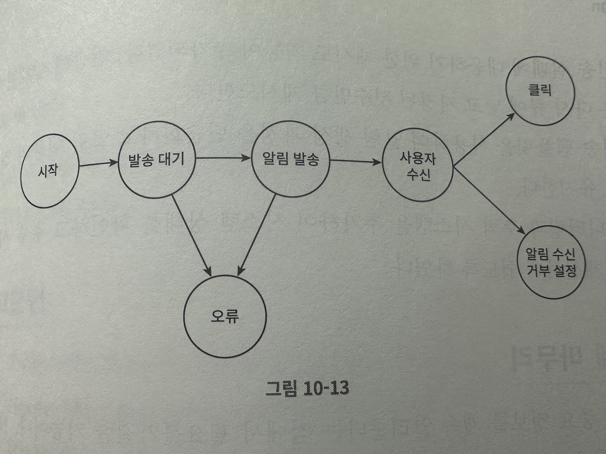
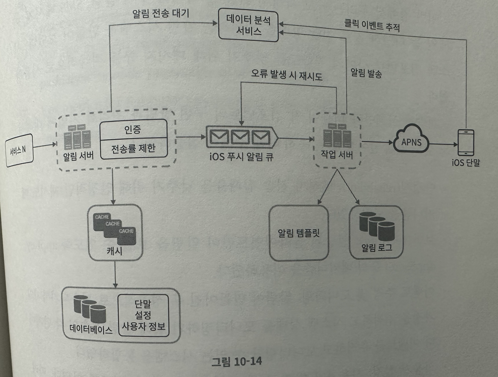

# 주제
- 10장: 알림 시스템 설계
# 알림 시스템 개요
- 사용자에게 유용한 정보(최신 뉴스, 제품 업데이트, 이벤트, 선물 등)를 다양한 채널(모바일 푸시 알림, SMS 메시지, 이메일)을 통해 사용자에게 전달
# 1. 문제 이해 및 설계 범위 확정
- 채널 종류: 푸시 알림, SMS 메시지, 이메일
- 연성 실시간(soft real-time): 알림은 가능한 한 빨리 전달되어야 하나, 시스템 과부하 시 약간의 지연은 무방
- 단말 종류: iOS 단말, Android 단말, 랩톱/데스크톱
- 알림 제공자: 클라이언트 애플리케이션 프로그램, 서버 측 스케줄링
- 알림 미수신 설정: 사용자가 해당 설정 시, 알림 미수신
- 알림 전송량:
	- 모바일 푸시 알림: 1000만 건
	- SMS 메시지: 100만 건
	- 이메일: 500만 건
# 2. 개략적 설계안 제시 및 동의 구하기
## 알림 유형별 지원 방안
### iOS 푸시 알림
#### 컴포넌트
##### 알림 제공자
- 알림 요청을 만들어 애플 푸시 알림 서비스로 보내는 주체
- 필수 정보
	- 단말 토큰: 알림 요청 전송 시 필요한 고유 식별자
	- 페이로드: 알림 내용이 포함된 JSON 딕셔너리
```json
{
  "aps": {
    "alert": {
      "title": "Game Request",
      "body": "Bob wants to play chess",
      "action-loc-key": "PLAY"
    },
    "badge": 5
  }
}
```
##### APNS(Apple Push Notification Service)
- 애플이 제공하는 원격 서비스로, 푸시 알림을 iOS 장치로 전달하는 역할
##### iOS 단말
- 푸시 알림을 수신하는 사용자 단말
### 안드로이드 푸시 알림
- iOS 푸시 알림과 비슷한 절차로 전송되나, ALPN 대신 FCM(Firebase Cloud Messaging) 사용
### SMS 메시지
- SMS 메시지 전송에는 보통 제3사업자(트윌리오, 넥스모 등) 상용 서비스를 많이 이용하는데, 이런 서비스는 이용 요금 지불 필요
### 이메일
- 많은 회사가 사내 고유 이메일 서버 대신 상용 이메일 서비스 이용
- 센드그리드, 메일침프 같은 유명 서비스 존재
	- 전송 성공률 높음
	- 데이터 분석 서비스 제공
### 알림 유형 시스템 구성
- (제 3 사업자 제공 서비스) -> (단말)
	- APNS -> iOS 단말
	- FCM -> Android 단말
	- SMS 서비스 -> SMS 단말
	- 이메일 서비스 -> 이메일 수신 단말
## 연락처 정보 수집 절차
- 알림 전송을 위해서는 각종 정보(모바일 단말 토큰, 전화번호, 이메일 주소 등)가 필요
- 앱 설치 / 계정 등록 시, API 서버는 해당 서바용자 정보 수집 후 DB에 저장
	- DB 테이블 구조 (user:device = 1:N)
		- user
			- user_id
			- email
			- contry_code
			- phone_number
			- created_at
		- device
			- device_token
			- user_id: FOREIGN KEY(user.user_id)
## 알림 전송 및 수신 절차
### 개략적 설계안 (초안)
- 서비스(1~N):
	- 각 서비스가 마이크로 서비스 / 크론잡 / 분산 시스템 컴포넌트일 수 있음
	- 예시
		- 사용자에게 납기일을 알리고자 하는 과금 서비스
		- 배송 알림을 보내려는 쇼핑몰 웹사이트
- 알림 시스템:
	- 알림 전송/수신 처리의 핵심
	- 서비스(1~N)에 알림 전송을 위한 API 제공
	- 제3자 서비스에 전달할 알림 페이로드 생성
- 제3자 서비스:
	- 사용자에게 알림을 실제로 전달하는 역할
	- 쉽게 새로운 서비스를 통합하거나, 기존 서비스를 제거할 수 있도록 확장성 고려 필요
- iOS, 안드로이드, SMS, 이메일 단말: 사용자는 자기 단말에서 알림 수신
#### 문제점
- SPOF(Single-Point-Of-Failure): 알림 서비스에 서버가 하나밖에 없으면, 해당 서버 장애 발생 시 전체 서비스 장애로 이어짐
- 규모 확장성: 한 대의 서비스로 푸시 알림에 대한 전체 기능을 처리하여, 데이터베이스나 캐시 등 중요 컴포넌트 개별 증설 불가
- 성능 병목: 알림 처리 및 전송은 많은 자원을 필요한 작업일 수 있으므로, 모든 것을 한 서버에서 처리하면 사용자 트래픽 대량 발생 시간에 시스템 과부하 상태에 빠짐
### 개략적 설계안 (개선된 버전)
#### 개선 방향
- 데이터베이스와 캐시를 알림 시스템의 주 서버에서 분리
- 알림 서버를 증설 및 자동으로 수평적 규모 확장이 가능하도록 개선
- 메시지 큐를 이용해 시스템 컴포넌트 사이 강한 결합을 끊어냄
#### 설계
- 서비스(1~N): 알림 시스템 서버의 API를 통해 알림을 보낼 서비스
- 알림 서버
	- 알림 전송 API: 스팸 방지를 위해 보통 사내 서비스 또는 인증된 클라이언트만 이용 가능
	- 알림 검증: 이메일 주소, 전화번호 등에 대한 기본 검증 수행
	- 데이터베이스 또는 캐시 질의: 알림에 포함시킬 데이터 조회 기능
	- 알림 전송: 알림 데이터를 메시지 큐에 삽입함. 본 설계안의 경우, 하나 이상의 메시지 큐를 사용하므로 알림 병렬 처리 가능
> [!NOTE]
> 이메일 형태의 알림 전송 API 예제:
> `POST https://api.example.com/v/sms/send`
> 
> API 호출 시 전송 데이터 사례:
> ```json
> {
>   "to": [
>     {
>       "user_id": 123456
>     }
>   ],
>   "from": {
>     "email": "from_address@example.com"
>   },
>   "subject": "Hello, World!",
>   "content": {
>     {
>       "type": "text/plain",
>       "value": "Hello, World!"
>     }
>   }
> }
> ```
- 캐시: 사용자 정보, 단말 정보, 알림 템플릿 등을 캐싱
- 데이터베이스: 사용자, 알림, 설정 등 다양한 정보 저장
- 메시지 큐:
	- 시스템 컴포넌트 간 의존성 제거를 위해 사용
	- 다양한 알림이 전송되어야 하는 경우를 대비한 버퍼 역할
	- 본 설계안은 알림의 종류별로 별도 메시지 큐 사용
		- 제3자 서비스 가운데 하나에 장애가 발생해도 다른 종류의 알림은 정상 동작
- 작업 서버: 메시지 큐에서 전송할 알림을 꺼내서 제3자 서비스로 전달하는 역할
- 제3자 서비스
- iOS, 안드로이드, SMS, 이메일 단말
#### 동작 방식
1. (서비스(1~N) -> 알림 서버) API를 호출하여 알림 전송
2. (알림 서버 -> DB/캐시) 사용자 정보, 단말 토컨, 알림 설정 같은 메타데이터를 캐시 / DB에서 조회
3. (알림 서버 -> 메시지 큐) 전송할 알림에 맞는 이벤트 생성 후, 해당 알림 채널에 할당된 메시지 큐에 삽입
4. (작업 서버 -> 메시지 큐) 메시지 큐에서 알림 이벤트를 꺼냄
5. (작업 서버 -> 제3자 서비스) 알림 전달
6. (제3자 서비스 -> 사용자 단말) 알림 전송
# 3. 상세 설계
## 안정성
- 안정성 확보를 위한 고려사항
### 데이터 손실 방지
- 알림 지연 / 순서 틀어짐은 괜찮아도 알림 소실 방지는 반드시 필요하므로, 알림 데이터를 DB에 보관 후 재시도하는 매커니즘 구현 필요
	- 알림 로그 데이터베이스 유지
		- iOS 푸시 알림 큐 -> 작업 서버 -> 알림 로그 데이터베이스 / APNS
### 알림 중복 전송 방지
- 같은 알림 중복 전송을 원천 차단하는 것은 불가능하므로, 중복 전송 빈도를 줄여야 함
- 중복 탐지 매커니즘 도입 후, 오류를 신중히 처리
	- 전송 대상 알림 도착 시, 이벤트 ID 기준으로 중복 이벤트 여부 판단하여 중복이 아닌 경우 알림 발송
### 추가로 필요한 컴포넌트 및 고려사항
#### 알림 템플릿
- 알림 메시지 유사성을 고려하여 알림 템플릿을 통해 알림 메시지를 만들어 내는 틀
- 알림 형식을 일관성 있게 유지하여 오류 가능성 및 알림 작성 시간 절약

> [!NOTE]
> **예시**   
> 본문:
> `여러분이 꿈꿔온 그 상품을 우리가 준비했습니다. [item_name]이 다시 입고되었습니다! [date]까지만 주문 가능합니다!`
> 
> 타이틀(CTA: Call to Action):
> `지금 [item_name]을 주문 또는 예약하세요!`

#### 알림 설정
- 알림 수신 여부를 사용자가 결정할 수 있도록 설정 제공 및 알림 전송 전, 알림 설정 사용 여부 확인 필요
> [!NOTE]
> 예시
> ```
> user_id    bigInt
> channel    varchar
> opt_in     boolean
> ```
#### 전송률 제한
- 사용자가 받을 수 있는 알림의 빈도를 제한
	- 사용자가 알림을 너무 많이 받으면 알림 기능을 아예 꺼버릴 수 있음
#### 재시도 방법
- 제3자 서비스가 알림 전송 실패 시, 해당 알림을 재시도 전송 큐에 삽입
- 동일한 문제가 계속 발생 시, 개발자에게 통지
#### 푸시 알림과 보안
- iOS / 안드로이드 앱의 경우, 알림 전송 API는 appKey / appSecret을 사용하여 보안 유지
- 인증 / 승인 된 클라이언트만 해당 API를 사용하여 알림 전송 가능
#### 큐 모니터링
- 알림 시스템의 메트릭(큐에 쌓인 알림 개수) 모니터링을 통해 작업 서버 증설 필요 여부 판단
#### 이벤트 추적
- 알림 확인율, 클릭율, 실제 앱 사용으로 이어지는 비율 같은 메트릭을 통해 사용자 이해 필요
- 데이터 분석 서비스에서 보통 이벤트 추적 기능도 제공
- 보통 알림 시스템은 데이터 분석 서비스와 통합 필요


### 수정된 설계안


#### 추가된 컴포넌트
- 알림 서버
	- 인증 / 전송률 제한 기능 추가
- 오류 발생 시 재시도: 전송 실패 대응을 위해, 전송 실패된 알림을 큐에 재삽입 후 지정된 횟수만큼 재시도하는 기능 추가
- 알림 템플릿: 알림 생성 과정 단순화 및 알림 내용 일관성 유지
- 모니터링 / 추적: 시스템: 시스템 상태 확인을 통해 추후 시스템 개선이 쉽도록 함
# 4. 마무리
- 개략적 설계안과 더불어 각 컴포넌트의 구현 방법과 최적화 기법에 대해서 심도 있게 확인하였음
## 고려 사항
- 안정성: 메시지 전송 실패율 저감을 위한 안정적인 재시도 매커니즘 도입
- 보안: appKey, appSecret 매커니즘을 통해 인증된 클라이언트만이 알림 전송 가능
- 이벤트 추적 및 모니터링: 알림 생성 및 전송 성공 여부를 추적하고 시스템 상태를 모니터링하기 위해, 알림 전송 각 단계별 이벤트 추적 / 모니터링이 가능한 시스템을 통합
- 사용자 설정: 사용자가 알림 수신 설정을 조정할 수 있음. 알림을 보내기 전 반드시 해당 설정을 확인하도록 시스템 설계 변경
- 전송률 제한: 사용자에게 알림을 보내는 빈도 제한
