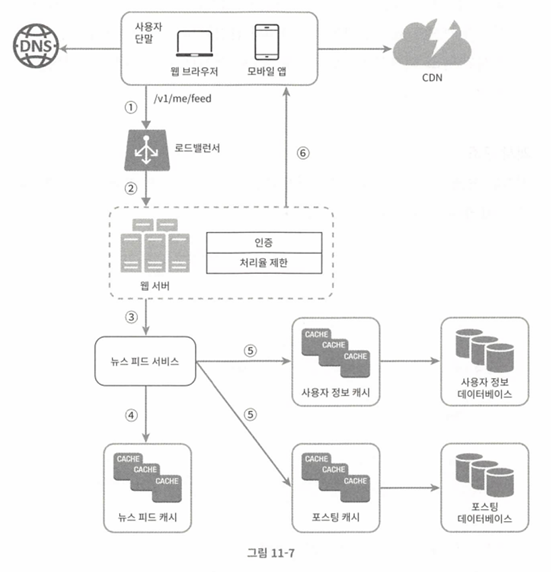
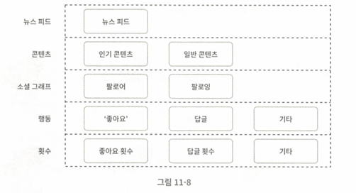

## 11\. 뉴스 피드 시스템 설계

1. 설계 범위
    - 웹 / 앱 모두 지원
    - 주요 기능
        - 사용자들이 페이지에 새로운 스토리를 올릴 수 있어야 함
        - 친구들이 올리는 스토리를 볼 수 있어야 함
    - 시간 흐름 역순으로 배치
    - 친구 MAX: 5000명
    - 트래픽 규모: 일 1000만 명
    - 이미지/비디오 등의 미디어 파일 포함

 

2. 개략적 설계
    - 피드 발행: 사용자가 스토리를 포스팅하면 해당 데이터를 캐시와 데이터베이스에 기록 → 새 포스팅은 친구의 뉴스피드에 전송
    - 뉴스 피드 생성: 지면 관게상 뉴스피드는 모든 친구의 포스팅을 시간 흐름 역순으로
    - 뉴스 피드 API
        - 피드 발행 (POST /v1/me/feed)
            - Auth Header
            - Body
        - 피드 읽기 (GET /v1/me/feed)
            - Auth Header

    - 아키텍처
        - 사용자: 모바일 앱 / 브라우저에서 새 포스팅을 올리는 주체
        - 로드밸런서: 트래픽을 웹 서버들로 분산
        - 웹 서버: HTTP 요청을 내부 서비스로 중계
        - 포스팅 저장 서비스: 새 포스팅을 데이터베이스와 캐시에 저장
        - 포스팅 전송 서비스: 새 포스팅을 친구의 뉴스 피드에 푸시 (캐시에 보관하여 빠르게 읽어갈 수 있도록)
        - 알림 서비스: 친구들에게 새 포스팅이 올라왔음을 알리거나 푸시 알림을 보내는 역할
    - 뉴스 피드 생성
        - 웹/앱 → 로드밸런서 → 웹 서버 → 뉴스 피드 서비스 → 뉴스 피드 캐시

 

3. 상세 설계
    - 피드 발행 흐름 상세 설계
        - 웹 서버
            - 클라이언트와 통신, 인증, 처리율 제한
            - 스팸, 유해 콘텐츠 방지를 위해 사용자당 포스팅 수에 제한
        - 포스팅 전송 (fanout)
            - 특정 사용자의 새 포스팅을 친구 관계인 모든 사용자에게 전달하는 과정
            - 쓰기 시점 fanout (push) vs 읽기 시점 fanout (pull)
                - 쓰기 시점: 포스팅을 기록하는 시점에 뉴스피드 갱신 → 포스팅이 완료되면 바로 해당 사용자의 캐시에 해당 포스팅을 기록
                    - 장점
                        - 뉴스피드가 실시간으로 갱신 및 즉시 전송
                        - 새 포스팅이 기록 되는 순간에 뉴스 피드가 이미 갱신되므로 뉴스 피드를 읽는 데 드는 시간이 짧아짐
                    - 단점
                        - 친구가 많은 사용자의 경우, 친구 목록을 가져오고 그 목록에 있는 사용자 모두의 뉴스피드를 갱신하는데 많은 시간이 소요될 수 있음 (HotKey)
                        - 서비스를 자주 이용하지 않는 사용자의 피드까지 갱신해야 하므로 자원 낭비가 있을 수 있음

                - 읽기 시점: 피드를 읽어야 하는 시점에 뉴스 피드를 갱신 (요청 기반 모델), 사용자가 본인 피드를 로딩하는 시점에 새로운 포스트를 가져옴
                    - 장점
                        - 비활성화된 사용자, 거의 로그인하지 않는 사용자의 경우에 유리
                        - 로그인하기까지는 컴퓨팅 자원이 낭비되지 않음
                        - 데이터를 친구 각각에 푸시하는 작업이 없기 때문에, 핫키 문제가 생기지 않음
                    - 단점
                        - 뉴스 피드를 읽는데 많은 시간이 소요될 수 있음

                - 결론
                    - 친구가 많으면 pull, 친구가 없으면 puSSY

 

4. 동작
    - 친구 목록 조회
    - 친구 걸러내기(알림 안받는다고 설정한 친구들)
    - 친구목록과 새 포스팅 ID 를 메시지 큐에 삽입
    - 팬아웃 서버에서 포스트ID, 친구ID 를 캐시에 저장 (캐시 용량 제한, 최신것들 위주)

 

 

 

5. 클라이언트가 뉴스 피드를 읽는 과정
    - 사용자가 뉴스 피드 일긱 요청 (GET /v1/me/feed)
    - 요청을 받은 웹 서버는 피드를 가져오기 위해 뉴스 피드 호출
    - 뉴스 피드 서비스는 **뉴스 피드 캐시에서 포스팅 ID 목록을 가져옴**
    - 뉴스 피드에 표시할 사용자 이름, 사용자 사진, 포스팅 콘텐츠, 이미지 등을 사용자 캐시와 포스팅 캐시에 가져와 완전한 뉴스 피드를 만든다
    - 생성된 뉴스 피드를 JSON 형태로 클라이언트에 보냄 -> 클라이언트는 해당 피드 렌더링

###  

6. 캐시 구조

 

- 뉴스 피드: 뉴스 피드의 ID를 보관
- 콘텐츠: 포스팅 데이터를 보관, 인기 콘텐츠는 따로 보관
- 소셜 그래프: 사용자 간 관계 정보를 보관
- 행동(action): 포스팅에 대한 사용자의 행위에 관한 정보를 보관, 포스팅에 대한 '좋아요', 답글 등등이 이에 해당
- 횟수(counter): '좋아요' 횟수, 응답 수, 팔로어 수, 팔로잉 수 등의 정보를 보관

 

7. 그 외에 다루면 좋은 점들
    - 데이터베이스 규모 확장
        - 수직적 규모 확장 VS 수평적 규모 확장

        - SQL vs NoSQL
        - 주/부 다중화
        - 복제본에 대한 읽기 연산
        - 일관성 모델
        - 데이터베이스 샤딩
    - 다른 논의 주제
        - 웹 계층 무상태 운영
        - 가능한 한 많은 데이터를 캐시할 방법
        - 여러 데이터 센터를 지원할 방법
        - 메시지 큐를 사용해 컴포넌트 결합도 낮추기
        - 핵심 메트릭에 대한 모니터링 (트래픽이 몰리는 시간대의 QPS, 새로고침 지연시간 등)

 