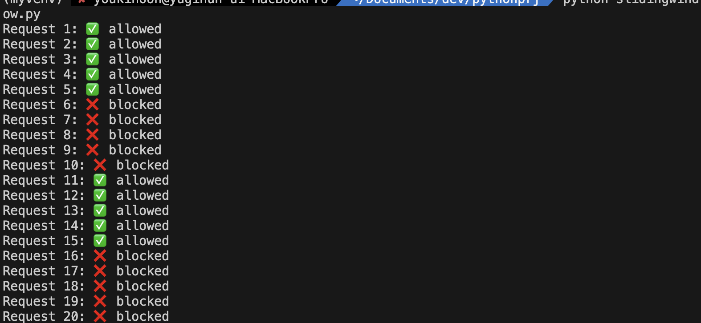
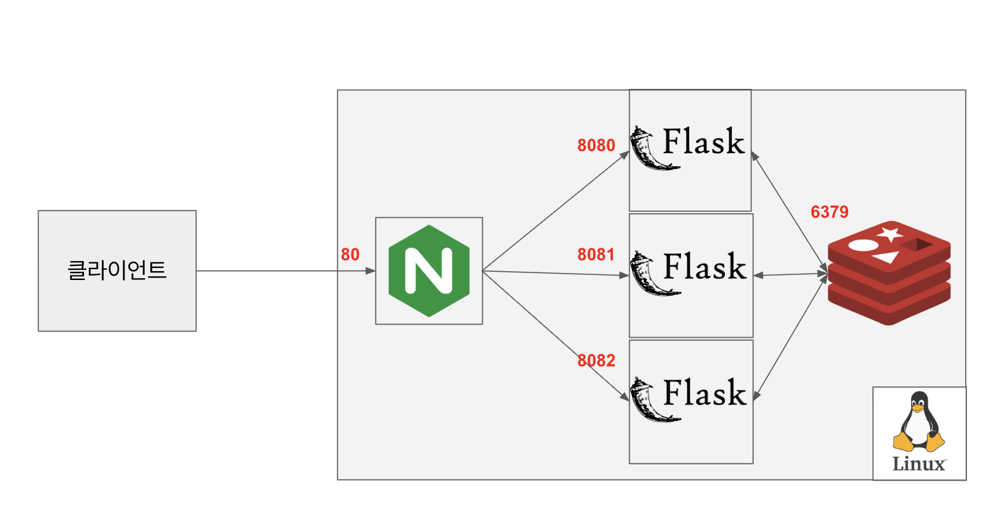
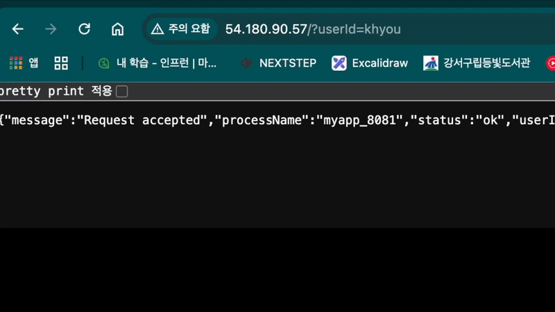
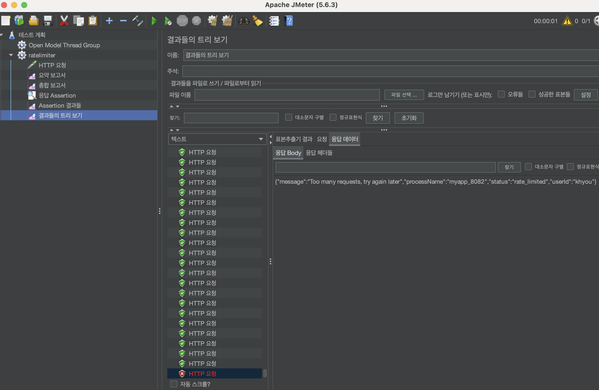

# 슬라이딩 윈도우 카운터 알고리즘

슬라이딩 윈도우 카운터 알고리즘 = 고정 윈도 카운터 알고리즘 + 윈도 로깅 알고리즘

### 고정 위도우 카운터 알고리즘
타임라인을 **고정된 시간 간격**의 윈도우로 나누고, 각 윈도우에서 요청 수를 센다. 카운터가 임계치에 도달하면 새 윈도우가 열릴 때까지 요청을 거부하며, 윈도우 경계에서 트래픽이 집중되면 할당량보다 더 많은 요청을 허용할 수 있다는 단점이 있다.
### 윈도우 로깅 알고리즘
요청이 올 때마다 **타임스탬프를 로그에 저장**하고, 현재 시간 기준으로 만료된 타임스탬프를 제거하여 유효한 요청 수만 유지한다. 가장 정확하게 처리율을 제한하지만, 모든 요청의 타임스탬프를 저장해야 하므로 **가장 많은 메모리**를 사용한다.
### 슬라이딩 윈도우 카운터 알고리즘
고정 윈도우의 단점을 보완하기 위해, 현재 윈도우와 직전 윈도우의 카운터를 **겹치는 비율**에 따라 가중 평균하여 요청 수를 추정한다. 이는 윈도우 경계의 문제점을 줄이면서도 메모리 효율이 비교적 좋다.

고정 윈도우 카운터, 윈도우 로깅 알고리즘의 단점을 보완하고 장점을 갖춘 슬라이딩 윈도우 카운터 알고리즘으로 처리율 제한 장치를 구현해보자. (토큰 버킷 알고리즘은 실무에서 적용해봤어서 제외했다.)

## 코드
``` python
import time
import redis

lua_script = """
local key = KEYS[1]
local now = tonumber(ARGV[1])
local window = tonumber(ARGV[2])
local limit = tonumber(ARGV[3])

-- 오래된 항목 제거
redis.call('ZREMRANGEBYSCORE', key, 0, now - window)

-- 현재 개수 확인
local count = redis.call('ZCARD', key)

if count < limit then
	redis.call('ZADD', key, now, tostring(now))
	redis.call('EXPIRE', key, window)
	return 1 -- 허용
else
	return 0 -- 거절
end
"""

def allow_request(rate_limiter, user_id):
	key = f"rate_limit:{user_id}"
	now = time.time()
	allowed = rate_limiter(keys=[key], args=[now, 10, 5]) # 윈도우 10초, 최대 5회
	return allowed == 1
  
if __name__ == "__main__":
	# Redis 연결
	r = redis.StrictRedis(host='localhost', port=6379, db=0)
	rate_limiter = r.register_script(lua_script)
	
	user = "user123"
	for i in range(20):
		allowed= allow_request(rate_limiter, user)
		print(f"Request {i+1}: {'✅ allowed' if allowed else '❌ blocked'}")
		time.sleep(1)
```

### 코드 동작 방식
1. local key = KEYS[1] → Python에서 전달받은 첫 번째 키(rate_limit:user123)를 로컬 변수 key에 저장한다.
2.  local now = tonumber(ARGV[1]) → 현재 시각(초 단위, float)을 숫자로 변환해 now 변수에 저장한다.
3. local window = tonumber(ARGV[2]) → 제한할 윈도우 크기(예: 10초)를 숫자로 변환해 window 변수에 저장한다.
4. local limit = tonumber(ARGV[3]) → 허용 가능한 최대 요청 수(예: 5)를 숫자로 변환해 limit 변수에 저장한다.
5. redis.call('ZREMRANGEBYSCORE', key, 0, now - window) → window 시간보다 오래된 요청 기록을 모두 삭제한다.
6. local count = redis.call('ZCARD', key) → 현재 윈도우 내에 남아있는 요청 수를 가져와 count 변수에 저장한다.
7. if count < limit then → 현재 요청 수가 제한값보다 작으면 허용할지 여부를 판단하기 시작한다.
8. redis.call('ZADD', key, now, tostring(now)) → 허용된 요청의 타임스탬프를 ZSET에 추가한다.
9. redis.call('EXPIRE', key, window) → 키(key)에 TTL을 설정하여 윈도우 시간 후 자동 삭제되도록 한다.
10. return 1 -- 허용 → 요청이 허용되었음을 의미하는 1을 반환한다.
11. else → return 0 -- 거절 → 요청이 거절되었음을 의미하는 0을 반환한다.


실행하면 위와 같이 결과가 출력된다. 이제 분산환경에서도 위 코드가 잘 동작하는지 확인해보자.

# 분산환경에서의 처리율 제한 장치 설계

## 아키텍처
Flask(Python Web Framework) 에서는 사용자 ID 기반으로 처리율 제한을 한다. 분산환경에서 처리 가능하도록 카운터 저장소는 Redis를 사용한다. Nginx는 클라이언트 요청을 받아서 3개의 웹서버에 요청을 분산하는 로드 밸런서 역할을 한다.



## 코드
``` python
import redis
import time
from flask import Flask, request, jsonify

app = Flask(__name__)

# 전역 변수로 프로세스 이름 저장
PROCESS_NAME = None

# Redis 연결 (모든 프로세스가 같은 Redis 사용)
redis_client = redis.Redis(host='localhost', port=6379, db=0)

# rate limit 설정
MAX_REQUESTS = 10       # 허용 요청 수
WINDOW_SIZE = 60       # 초 단위

lua_script = """
local key = KEYS[1]
local now = tonumber(ARGV[1])
local window = tonumber(ARGV[2])
local limit = tonumber(ARGV[3])

-- 오래된 항목 제거
redis.call('ZREMRANGEBYSCORE', key, 0, now - window)

-- 현재 개수 확인
local count = redis.call('ZCARD', key)

if count < limit then
    redis.call('ZADD', key, now, tostring(now))
    redis.call('EXPIRE', key, window)
    return 1 -- 허용
else
    return 0 -- 거절
end
"""

rate_limiter = redis_client.register_script(lua_script)

def is_request_allowed(user_id):
    key = f"rate_limit:{user_id}"
    now = time.time()
    allowed = rate_limiter(keys=[key], args=[now, WINDOW_SIZE, MAX_REQUESTS])  # 윈도우 10초, 최대 5회
    return allowed == 1

@app.route("/")
def index():
    user_id = request.args.get("userId")
    if not user_id:
        return jsonify({"error": "userId query parameter is required"}), 400

    allowed = is_request_allowed(user_id)

    if allowed:
        return jsonify({
            "status": "ok",
            "userId": user_id,
            "message": "Request accepted",
            "processName": PROCESS_NAME
        }), 200
    else:
        return jsonify({
            "status": "rate_limited",
            "userId": user_id,
            "message": "Too many requests, try again later",
            "processName": PROCESS_NAME
        }), 429


if __name__ == "__main__":
    import sys
    if len(sys.argv) < 2:
        print("Usage: python rate_limiter.py <port>")
        exit(1)

    port = int(sys.argv[1])
    PROCESS_NAME = "myapp_" + str(port)
    app.run(host="127.0.0.1", port=port)
```

## NginX 설정
```
upstream flask_servers {
    server 127.0.0.1:8080;
    server 127.0.0.1:8081;
    server 127.0.0.1:8082;
}

server {
    listen 80;
    server_name {domain};   # 서버 공인 IP 또는 도메인

    location / {
        proxy_pass http://flask_servers;
        proxy_set_header Host $host;
        proxy_set_header X-Real-IP $remote_addr;
        proxy_set_header X-Forwarded-For $proxy_add_x_forwarded_for;
    }
}
```

## 결과

https://velog.io/@dev-gromit/%EC%B1%85%EB%8C%80%EA%B7%9C%EB%AA%A8-%EC%8B%9C%EC%8A%A4%ED%85%9C-%EC%84%A4%EA%B3%84-%EC%B2%98%EB%A6%AC%EC%9C%A8-%EC%A0%9C%ED%95%9C-%EC%9E%A5%EC%B9%98-%EC%8B%A4%EC%8A%B5

## 부하 테스트
부하 테스트에도 문제가 없는지 확인해보기 위해 60초 동안 1,000건이 허용되게 하여 jmeter로 테스트 해보았다.
1,001건을 요청하니 마지막 1건이 실패하는 것을 확인했다.

