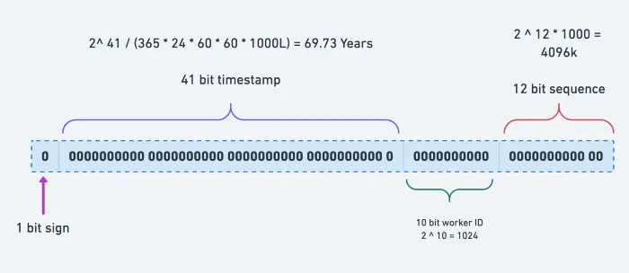

# 1단계: 문제 이해 및 설계 범위 확정
요구사항을 확실하게 정리해야 한다. 질문을 할 때는 요구사항을 이해하고 모호함을 해소하는 데 초점을 맞추어야 한다.
- ID는 유일해야 한다.
- ID는 숫자로만 구성해야 한다.
- ID는 64비트로 표현될 수 있는 값이어야 한다.
- ID는 발급 날짜에 따라 정렬 가능해야 한다.
	- 정렬 가능해야 좋은 이유: 
- 초당 10,000개의 ID를 만들 수 있어야 한다.

# 2단계: 개략적 설계안 제시 및 동의 구하기
## auto increment 는 사용 불가능한 이유
- 분산 데이터베이스 환경에서 PK가 중복될 수 있기 때문에, 식별자의 유일성이 보장되지 않는다.
- 클라이언트 측에 노출하면 보안 문제 발생 가능성 존재
	- 데이터의 개수 또는 특정 시점의 식별자 예측 가능

## 다중 마스터 복제
- 이 접근법은 auto_increment를 활용하는 것이다. 다음 ID의 값을 구할 때 1만큼 증가시키는 것이 아니라, k만큼 증가시킨다.
	- k: 현재 사용 중인 데이터베이스 서버의 수
**단점**
이 방법은 중대한 단점이 존재한다.
- 여러 데이터 센터에 걸쳐 규모를 늘리기 어렵다.
- ID의 유일성은 보장되겠지만 그 값이 시간 흐름에 맞추어 커지도록 보장할 수는 없다.
	- 이유: DB1과 DB2에 데이터 A, B, C를 순서대로 저장한다고 했을 때 DB1에 A, B가 입력되서 A는 ID가1, B는 ID가3이 되었고, 데이터 C가 DB2에 저장 되면 C는 ID 2를 가진다. B보다 C가 나중에 입력되었는데 ID가 더 작다.
- 서버를 추가하거나 삭제할 때도 잘 동작하도록 만들기 어렵다.

## UUID
UUID를 ID로 사용하면 만들기도 쉽고, 중복될 확률이 웬만해서 없기 때문에 유용하다. 하지만 UUID는 무작위 문자열이기 때문에 ID로 사용하면 성능 관련된 단점이 존재한다.

**단점**
- Clustered Index는 정렬된 상태를 유지한다. 데이터 삽입 필요한 인덱스 페이지가 가득 찼다면, B+ tree 재구성 및 페이지 분할로 디스크 I/O가 증가한다.
- PK를 이용한 범위 조회가 필요하다면, 디스크에서 랜덤 I/O가 발생하기 때문에, 순차 I/O보다 성능이 저하된다.
	- UUID의 정렬이 불가능하다는 단점을 극복한 키 생성 방식인 ULID가 있다. ULID는 정렬이 가능하기는 하지만 128비트로 저장 공간을 많이 차지한다는 단점이 있다.
- ID가 128비트로 길기 때문에 앞서 언급된 요구사항을 맞추지 못하며, 저장 공간을 많이 차지한다.
- ID에 숫자가 아닌 값이 포함되기 때문에 앞서 언급된 요구사항을 맞추지 못한다.

## 티켓 서버
티켓 서버의 핵심은 auto_increment 기능을 갖춘 데이터베이스 서버, 즉 티켓 서버를 중앙 집중형으로 하나만 사용하는 것이다.

**장점**
- 유일성이 보장되는 오직 숫자로만 구성된 ID를 쉽게 만들 수 있다.
- 구현하기 쉽다.
**단점**
- 티컷 서버가 SPOF(Single-Point-of-Failure)가 된다면 해당 서버를 이용하는 모든 시스템이 영향을 받는다.
	- 이 이슈를 피하려면 티켓 서버를 분산해야 하는데 이러면 데이터 동기화 같은 새로운 문제가 발생한다.

## 트위터 스노플레이크 접근법

트위터가 공개한 스노플레이크 오리지널 구조

- 사인 비트(1bit): 지금은 쓰임세 X, 나중에 사용하기 위한 용도
- 타임스탬프(41bit): 기원 시각 이후로 몇 밀리초가 경과했는지 나타내는 값
- 머신 ID(10bit): 데이터 저장소의 식별자. 데이터 센터 ID + 서버 ID 로 조합할 수도 있다.
- 일련번호(12bit): 각 서버에서는 ID를 생성할 때 마다 이 일련 번호를 1만큼 증가시킨다. 이 값은 1밀리초가 경과할 때마다 0으로 초기화된다.

## 3단계: 상세 설계
### 타임스탬프
타임스탬프는 41bit를 차지한다. 타임스탬프로 표현할 수 있는 최대 값은 69년에 해당한다. ID를 생성하는 머신이 동작하기 시작한 날로부터 69년까지만 ID를 생성할 수 있다. 69년이 지나면 기원 시각을 바꾸거나 ID 체계를 다른 것으로 이전해야 한다.

## 4단계: 마무리
- 시계 동기화: 이번 설계를 진행하면서 우리는 ID 생성 서버들이 전부 같은 시계를 사용한다고 가정했다. 하지만 이런 가정은 하나의 서버가 여러 코어에서 실행될 경우 유효하지 않을 수도 있다. NTP(NETWORK TIME PROTOCOL)은 이 문제를 해결하는 가장 보편적 수단이다.
- 스노프레이크 방식에서 각 절의 길이 최적화: 동시성이 낮고 수명이 긴 애플리케이션이라면 일련번호 절의 길이를 줄이고 타임스탬프 절의 길이를 늘리는 것이 효과적일 수 있다.
- 고가용성: ID 생성기는 필수 불가결 컴포넌트이므로 아주 높은 가용성을 제공해야 한다.